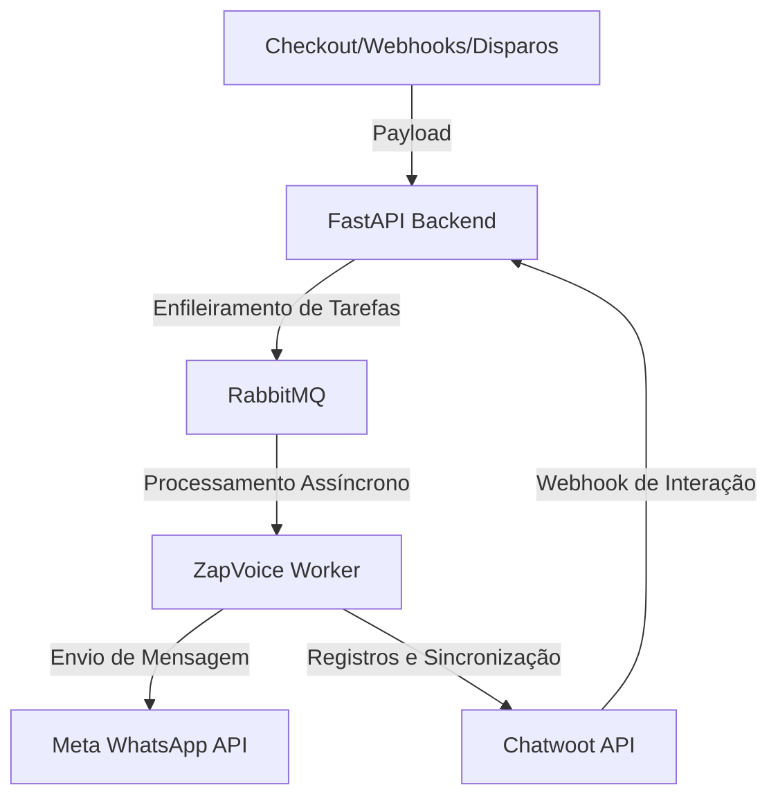

# ⚡ ZapVoice - Automação WhatsApp API Oficial (v4.0.7)

Este repositório contém as novas regras de validação rígida de parâmetros de templates no Disparo em Massa (Bulk Sender) para evitar envios em branco, suporte e destaque de Testes de Escala (`SCALE_TEST`) com rotulação especial e badge de Simulação, além de novas funcionalidades de fluxo de funil aprimoradas, detalhamento dinâmico do histórico de automações em tempo real com contagem inteligente e reconciliação robusta de interações/cliques de contatos, duplicação de funis para facilitar clonagem de fluxos e visualização granular da Fila da Meta.

O **ZapVoice** é um ecossistema completo e profissional de automação e marketing de alta performance integrado à **API Oficial do WhatsApp (Meta)** e ao **Chatwoot**. 

---

## 🚀 Como o Projeto Funciona?

O ZapVoice atua como uma ponte inteligente entre suas fontes de leads (formulários, checkout de vendas, etc.) ou disparos manuais e a API Oficial da Meta.



### O Fluxo Geral:
1. **Entrada de Leads**: O sistema recebe dados via webhooks (de plataformas de vendas como Kiwify, Hotmart ou Eduzz) ou por importações de arquivos e etiquetas de contatos.
2. **Fila de Mensageria**: Para garantir estabilidade e evitar perdas de envios em picos de tráfego, todas as ações são enfileiradas através do **RabbitMQ**.
3. **Worker**: O Worker consome as mensagens da fila, processa as substituições de variáveis, valida as regras de compliance (janela de 24h e lista de bloqueados) e faz os envios através da API Oficial da Meta.
4. **Chatwoot**: Cada disparo cria ou atualiza uma conversa correspondente no Chatwoot do cliente, inserindo notas privadas de depuração de forma transparente.

---

## 📺 Principais Funcionalidades

### 1. Disparo em Massa (Bulk Sender)
Permite enviar mensagens e templates aprovados pela Meta para múltiplos contatos ao mesmo tempo:
*   **Modos de Envio**: Importação de planilha Excel/CSV, inserção manual ou carregamento por etiquetas (tags) de leads cadastrados.
*   **Compliance de Envio**: Permite validar canais e verificar a janela de 24h antes do envio, além de gerenciar um painel de exclusão rápida de números da lista.

### 2. Disparos Recorrentes
Permite reenvio automático de templates em períodos definidos (semanal ou mensal) filtrando dinamicamente pelas etiquetas aplicadas aos contatos na base de dados.

### 3. Construtor Visual de Funis (Visual Flow Builder)
Criação gráfica em estilo *drag-and-drop* de fluxos de conversação inteligentes:
*   **Nós de Delays**: Intervalos de tempo fixos ou aleatórios para simular a digitação humana.
*   **Nós de Mídias**: Envio de imagens, vídeos, PDFs e mensagens de áudio gravadas (enviadas como áudio gravado na hora).
*   **Condições Inteligentes (IA)**: Análise de resposta usando inteligência artificial da OpenAI (`gpt-4o-mini`) para ramificar o fluxo baseado na resposta livre do cliente.
*   **Botões Interativos**: Mensagens com botões de clique rápido que ramificam o fluxo dependendo da escolha do cliente.

### 4. Integrações de Webhooks
Integração nativa com **Hotmart, Kiwify, Eduzz (checkout Sun, Nutror, MyEduzz) e Elementor**: Mapeie automaticamente as mudanças de status (compra aprovada, pix gerado, carrinho abandonado, evento de aluno) para disparar funis específicos.

---

## 🛠️ Passo a Passo para Usar a Interface

Para começar a operar no painel do ZapVoice, siga as etapas descritas abaixo:

### Passo 1: Acesso ao Painel
1. Acesse o frontend no seu navegador em: `http://localhost:5176` (caso esteja rodando localmente).
2. Utilize as credenciais padrão de desenvolvimento:
   *   **E-mail**: `aryarajmarketing@gmail.com`
   *   **Senha**: `123456`

### Passo 2: Configuração de Canais (WhatsApp & Chatwoot)
Antes de realizar disparos, configure as conexões no modal de **Configurações** (ícone de engrenagem no menu lateral):
1. **WhatsApp API**: Preencha as credenciais da Meta (`ID do Telefone`, `Token de Acesso Temporário ou Permanente` e `ID da Conta de Negócios`).
2. **Chatwoot**: Insira a `URL do Chatwoot` e a `Chave de API do Usuário` (AccessToken) para que o sistema sincronize conversas, caixas de entrada (Inboxes) e envie notas privadas.

### Passo 3: Criar um Funil de Mensagens
1. Acesse a aba **Funis de Mensagens** no menu lateral.
2. Clique em **Criar Novo Funil** ou selecione um existente.
3. No painel visual, ligue o nó de início (`Start`) a nós de mensagens, atrasos (*delays*) ou mídias.
4. Salve o funil.

### Passo 4: Configurar uma Integração de Webhook
Para automatizar disparos a partir de plataformas de vendas:
1. Acesse a aba **Integrações** no menu lateral.
2. Adicione uma nova integração selecionando a plataforma (ex: *Kiwify*).
3. Defina um **Slug Secreto** amigável (ex: `venda_campanha`). O ZapVoice gerará a URL de webhook para colar na sua plataforma (ex: `https://api.seudominio.com/api/webhooks/venda_campanha`).
4. Associe o status da compra (ex: *Aprovado*, *Pix Gerado*) ao funil de mensagens que você criou no Passo 3.

### Passo 5: Realizar Disparos em Massa ou Recorrentes
1. Acesse a aba **Disparo em Massa** ou **Disparo Recorrente Criado**.
2. Configure o template da Meta que deseja enviar e informe as variáveis dinâmicas (como `{{1}}` para o nome do lead).
3. Defina os dias e horários para as recorrências e salve. O painel listará a contagem de contatos ativos e ignorados em tempo real.

---

## 🧑‍💻 Como Rodar Localmente (Modo Desenvolvedor)

Certifique-se de ter o Docker e Docker Compose instalados no sistema. 

Execute o comando a partir do diretório raiz:
```bash
docker compose -f docker/docker-compose.local.yml up -d --build --force-recreate
```

O ecossistema subirá os seguintes contêineres:
*   **API FastAPI (Backend)**: rodando na porta `8000`.
*   **Web App (Frontend)**: rodando na porta `5176`.
*   **RabbitMQ**: rodando na porta `5679` (porta interna `5672`) e painel em `15679`.
*   **PostgreSQL**: rodando na porta `5435` (porta interna `5432`).
*   **Cloudflare Tunnel**: configurado para expor a API local para a internet de forma segura.