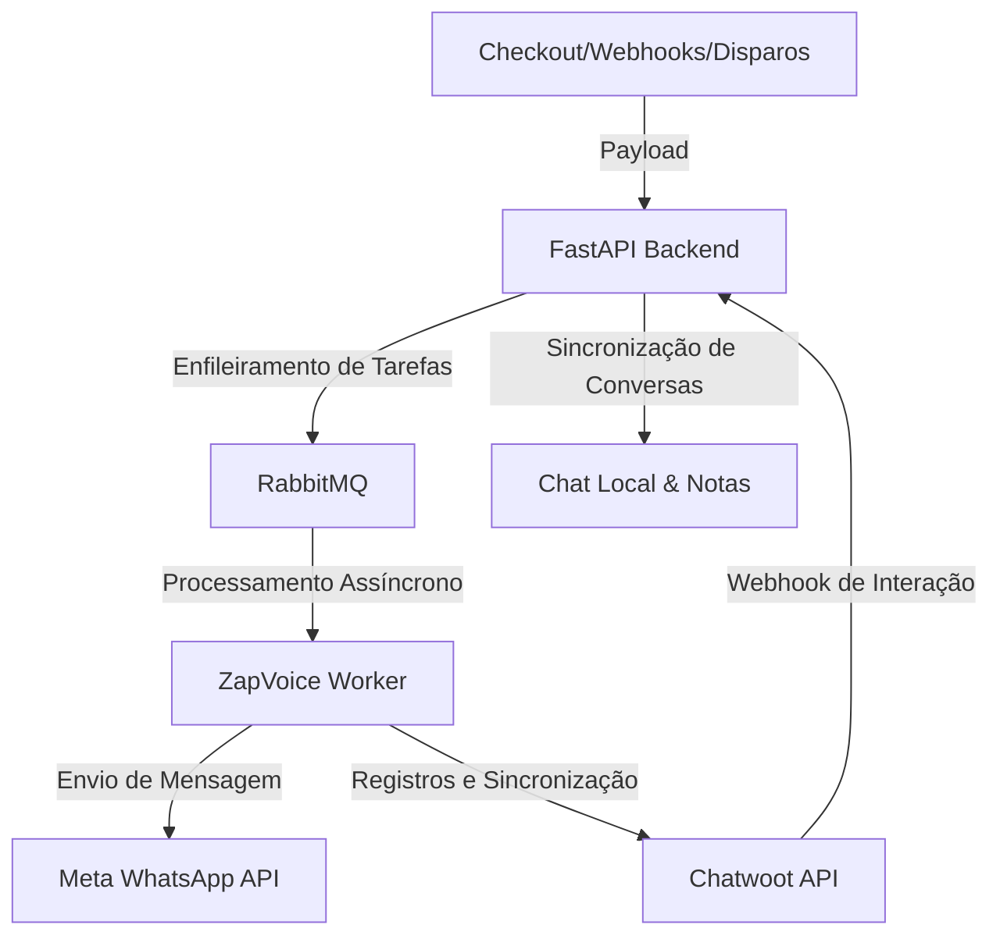

# ⚡ ZapVoice - Automação WhatsApp API Oficial (v1.8.5 — Versão Estável)

Versão estável com suporte ao **Novo Evento "Checkout Pré-populado" (PURCHASE_OUT_OF_SHOPPING_CART e Flags Multiplataforma)**, **Detecção Aprimorada de Order Bump na Hotmart v2.0.0**, **Auto-Correção e Sanitização de Mojibake (Caracteres Acentuados UTF-8/Latin-1)**, **Pipeline Completo de CI/CD no GitHub Actions (Build Automatizado, Publicação no Docker Hub e Redeploy Multi-Webhooks no Portainer)**, **Link Seguro de Criação e Redefinição de Senha para Usuários Existentes**, **Pacote Completo de Otimização e Performance de Banco de Dados PostgreSQL (Indexação de 100% das Foreign Keys, Índices Compostos de Alto Tráfego, Migração de 24 Colunas para JSONB com Índices GIN, Políticas de Retenção e Expurgos Automáticos / Data Purge e Ajuste Fino de Autovacuum)**, **Auditoria de Segurança Integrada (Backend pip-audit + Frontend npm audit)**, **PostgreSQL Avançado (Alembic, pg_trgm, LISTEN/NOTIFY em Tempo Real e Particionamento de Logs)**, **Mensagens Rápidas e Automáticas no Atendimento com Barra / e Modo Maximizado**, **Paginação e Rolagem Estilizada em Respostas Rápidas**, **Modais de Configuração e Exclusão com Backdrop em Tela Cheia via Portal**, **Deduplicação de Disparo de Funil por Botões de Ação**, **Modal de Confirmação de Disparo Imediato no Calendário**, **Reatividade dos Filtros Avançados de Funil Ativo no Chat**, **Filtragem de Vendas por Etiquetas de Contatos no Financeiro**, **Criação de Etiquetas Dinâmicas no Mapeamento de Webhooks**, **Desbloqueio em Lote de Contatos**, **Análise de Dúvidas de Atendimento com IA**, **Popup Modal de Escolha de Cor para Etiquetas**, **Anotações Privadas com Edição e Exclusão Segura**, **Otimização do Histórico de Disparos**, **Resiliência e Tratamento de Timeout no Worker**, **Exibição da Conta Destino e Rotação do ManyChat no Histórico de Integrações**, **Múltiplos Tokens do ManyChat com Rotação Sequencial (Round-Robin)**, **Botão de Fechar Conversa na Área de Atendimento**, **Módulo de E-mail Marketing Completo**, **Fila de Retentativa de Webhook (Retry Queue)** e **Sincronização com Worker em Container Separado**.


O **ZapVoice** é um ecossistema completo e profissional de automação e marketing de alta performance integrado à **API Oficial do WhatsApp (Meta)** e ao **Chatwoot**. 

---

## 🚀 Como o Projeto Funciona?

O ZapVoice atua como uma ponte inteligente entre suas fontes de leads (formulários, checkout de vendas, etc.) ou disparos manuais e a API Oficial da Meta.



### O Fluxo Geral:
1. **Entrada de Leads**: O sistema recebe dados via webhooks (de plataformas de vendas como Kiwify, Hotmart ou Eduzz) ou por importações de arquivos e etiquetas de contatos.
2. **Fila de Mensageria**: Para garantir estabilidade e evitar perdas de envios em picos de tráfego, todas as ações são enfileiradas através do **RabbitMQ**.
3. **Worker**: O Worker consome as mensagens da fila, processa as substituições de variáveis, valida as regras de compliance (janela de 24h e lista de bloqueados) e faz os envios através da API Oficial da Meta.
4. **Chatwoot**: Cada disparo cria ou atualiza uma conversa correspondente no Chatwoot do cliente, inserindo notas privadas de depuração de forma transparente.
5. **Chat Local**: Armazenamento e listagem local das conversas sincronizadas, permitindo visualizar o histórico de mensagens, enviar templates de forma ativa e visualizar notas privadas diretamente no ZapVoice.

---

## 📺 Principais Funcionalidades

### 1. Disparo em Massa (Bulk Sender)
Permite enviar mensagens e templates aprovados pela Meta para múltiplos contatos ao mesmo tempo:
*   **Modos de Envio**: Importação de planilha Excel/CSV, inserção manual ou carregamento por etiquetas (tags) de leads cadastrados.
*   **Compliance de Envio**: Permite validar canais e verificar a janela de 24h antes do envio, além de gerenciar um painel de exclusão rápida de números da lista.
*   **Busca e Filtros de Contatos**: Ferramentas de busca por número de telefone parcial, código de área internacional (DDI) e código de DDD estruturado para segmentação avançada no modal de histórico de disparos.

### 2. Disparos Recorrentes
Permite reenvio automático de templates em períodos definidos (semanal ou mensal) filtrando dinamicamente pelas etiquetas aplicadas aos contatos na base de dados.

### 3. Construtor Visual de Funis (Visual Flow Builder)
Criação gráfica em estilo *drag-and-drop* de fluxos de conversação inteligentes:
*   **Nós de Delays**: Intervalos de tempo fixos ou aleatórios para simular a digitação humana.
*   **Nós de Mídias**: Envio de imagens, vídeos, PDFs e mensagens de áudio gravadas (enviadas como áudio gravado na hora).
*   **Condições Inteligentes (IA)**: Análise de resposta usando inteligência artificial da OpenAI (`gpt-4o-mini`) para ramificar o fluxo baseado na resposta livre do cliente.
*   **Botões Interativos**: Mensagens com botões de clique rápido que ramificam o fluxo dependendo da escolha do cliente.

### 4. Chat Local & Sincronização Chatwoot
Visualização e controle de conversas diretamente no painel do ZapVoice:
*   **Mensagens e Templates**: Histórico de interações do cliente, notas de contexto do sistema e disparo manual de templates.
*   **Ações de Resposta Rápida (Botões HSM)**: Permite configurar o comportamento ao clicar nos botões do template (Nenhuma ação, Interação com início de Funil automático, ou Bloqueio do contato imediato).
*   **Janela de 24h & Inteligência de Custo**: Indicador visual inteligente no modal e avisos informativos sobre o custo de envio do template ( HSM Pago vs Mensagem Gratuita na janela de 24 horas ativa).
*   **Desbloqueio & Toggle Rápido**: Clicar no botão vermelho de bloqueio de um contato já bloqueado executa a ação de desbloqueio rápido direto do cabeçalho.
*   **Carregamento Premium**: Modal centralizado com spinner dinâmico e desfoque de fundo (backdrop-blur) ao carregar conversas com rolagem automática inteligente para a última mensagem.
*   **Integração de Webhook de Memória**: O envio do template HSM notifica imediatamente o assistente de IA/n8n com o conteúdo de texto resolvido e o ID interno da mensagem.
*   **Proteção de Sobrescrita de Nomes**: Mecanismo no backend que protege o nome real dos contatos e impede que webhooks externos os sobrescrevam com valores genéricos (como `Lead_3586`).
*   **Marcadores/Labels**: Gerenciamento de tags e rótulos aplicados a cada conversa para segmentação ágil.
*   **Remoção Automática de Etiquetas**: Configuração de etiquetas a serem removidas automaticamente da conversa do chat interno quando a janela de 24 horas expira.
*   **Filtro de Conversas por Data**: Possibilidade de segmentar conversas no atendimento em tempo real por data específica ou intervalo de datas (De/Até).


### 5. API Keys e Segurança
*   Geração e revogação de tokens de autenticação (`API Keys`) para garantir que apenas sistemas autorizados possam acionar webhooks públicos e rotas sensíveis do backend.
*   **Auditoria e Guia de Segurança**: Consulte o arquivo [`SECURITY.md`](file:///c:/Users/aryar/.gemini/antigravity/scratch/Projetos%20Serios/Projeto%20-%20ZapVoice%20no%20Chatwoot/SECURITY.md) para o roadmap completo de blindagem, boas práticas ativas e diagnóstico de segurança da aplicação.

### 6. Integrações de Webhooks & Mapeamento de Contatos
Integração nativa com as principais plataformas do mercado: **Hotmart, Kiwify, Eduzz (checkout Sun, Nutror, MyEduzz), Guru, Kirvano, Greenn, Cakto, Braip, Ticto, HeroSpark, Elementor e ZapGroup**.
*   **Mapeamento Completo de Status**: Mapeamento inteligente de eventos como Compra Aprovada, Pix Gerado, Boleto Impresso, Cartão Recusado, Carrinho Abandonado, Reembolso, Chargeback, Assinatura Ativa/Cancelada e Troca de Plano.
*   **Campos Customizados de Contato**: Permite configurar regras para extrair informações do payload do webhook (como e-mail, telefone, CPF, etc.) e salvá-los no contato local do lead.
*   **Inteligência de Vendas Casadas**: Detecção automática de ofertas **Order Bump** e campanhas de **Upsell / Upgrade** baseadas no nome do produto ou tags do payload para evitar duplicação ou segmentar funis específicos.
*   **Filtros de Interface e Ordenação**: Painel de visualização com dropdown de pesquisa por plataforma, filtros rápidos de integrações "Com Gatilhos" e "Com Histórico", e ordenação decrescente baseada na contagem total de disparos no histórico.

### 7. Webhook Leads e Filtros de Contato (BSUD)
Painel dedicado para qualificação e acompanhamento de contatos recebidos por webhooks e integrações:
*   **Filtro de WhatsApp Qualificado (BSUD)**: Permite segmentar contatos que possuem número de WhatsApp ativo e válido ("💬 WhatsApp Válido") daqueles que não possuem conta ativa ("⚠️ Sem WhatsApp").
*   **Segmentação Adicional**: Filtros integrados por status de bloqueio local, etiquetas (labels) do Chatwoot, busca textual e data de criação para facilitar ações de marketing.

---

## 🛠️ Passo a Passo para Usar a Interface

Para começar a operar no painel do ZapVoice, siga as etapas descritas abaixo:

### Passo 1: Acesso ao Painel
1. Acesse o frontend no seu navegador em: `http://localhost:5176` (caso esteja rodando localmente).
2. Utilize as credenciais padrão de desenvolvimento:
   *   **E-mail**: `aryarajmarketing@gmail.com`
   *   **Senha**: `123456`

### Passo 2: Configuração de Canais (WhatsApp & Chatwoot)
Antes de realizar disparos, configure as conexões no modal de **Configurações** (ícone de engrenagem no menu lateral):
1. **WhatsApp API**: Preencha as credenciais da Meta (`ID do Telefone`, `Token de Acesso Temporário ou Permanente` e `ID da Conta de Negócios`).
2. **Chatwoot**: Insira a `URL do Chatwoot` e a `Chave de API do Usuário` (AccessToken) para que o sistema sincronize conversas, caixas de entrada (Inboxes) e envie notas privadas.

### Passo 3: Criar um Funil de Mensagens
1. Acesse a aba **Funis de Mensagens** no menu lateral.
2. Clique em **Criar Novo Funil** ou selecione um existente.
3. No painel visual, ligue o nó de início (`Start`) a nós de mensagens, atrasos (*delays*) ou mídias.
4. Salve o funil.

### Passo 4: Configurar uma Integração de Webhook
Para automatizar disparos a partir de plataformas de vendas:
1. Acesse a aba **Integrações** no menu lateral.
2. Adicione uma nova integração selecionando a plataforma (ex: *Kiwify*).
3. Defina um **Slug Secreto** amigável (ex: `venda_campanha`). O ZapVoice gerará a URL de webhook para colar na sua plataforma (ex: `https://api.seudominio.com/api/webhooks/venda_campanha`).
4. Associe o status da compra (ex: *Aprovado*, *Pix Gerado*) ao funil de mensagens que você criou no Passo 3.

### Passo 5: Realizar Disparos em Massa ou Recorrentes
1. Acesse a aba **Disparo em Massa** ou **Disparo Recorrente Criado**.
2. Configure o template da Meta que deseja enviar e informe as variáveis dinâmicas (como `{{1}}` para o nome do lead).
3. Defina os dias e horários para as recorrências e salve. O painel listará a contagem de contatos ativos e ignorados em tempo real.

---

## 🔌 API Pública — Atualização de Contatos

O ZapVoice expõe um endpoint autenticado por **API Key** para integração com automações externas (n8n, Make, Zapier, etc.), permitindo atualizar dados de contatos diretamente da aba de contatos monitorados.

### Endpoint

```
POST /api/contacts/{telefone}/update
Authorization: Bearer zv_live_...
Content-Type: application/json
```

### Payload (todos os campos são opcionais)

```json
{
  "google_meet_link": "https://meet.google.com/abc-def-ghi",
  "meeting_at": "2026-07-20T14:00:00-03:00",
  "name": "João Silva",
  "inbox_id": 3
}
```

### Resposta

```json
{
  "status": "success",
  "message": "Contato 5511999990001 atualizado com sucesso.",
  "updated_fields": ["google_meet_link", "meeting_at"],
  "contact": {
    "phone": "5511999990001",
    "name": "João Silva",
    "inbox_id": 3,
    "google_meet_link": "https://meet.google.com/abc-def-ghi",
    "meeting_at": "2026-07-20T14:00:00-03:00"
  }
}
```

### Como gerar uma API Key
1. Acesse o dashboard ZapVoice → Menu lateral → **API Keys**
2. Clique em **Gerar Nova Chave** e dê um nome descritivo
3. Copie a chave gerada (ela só é exibida uma vez)
4. Use no header: `Authorization: Bearer zv_live_...`

> **Rate Limit:** 100 requisições por minuto por IP.

---

## 🗒️ Changelog

### v1.8.2 — Versão Estável (2026-08-25)
- ✅ **Identificação Inteligente de PIX no Webhook da Hotmart**: Corrigida a extração e resolução de status para pagamentos via PIX na Hotmart v2.0 enviados sob o evento `PURCHASE_BILLET_PRINTED`, garantindo a correta exibição do Método como "Pix" e Status Principal como "Pix Gerado", com preservação dos dados de `pix_code` e `pix_qrcode`.

### v1.8.1 — Versão Estável (2026-08-17)
- ✅ **Mensagens Rápidas e Automáticas no Atendimento**: Suporte completo a atalhos por barra `/` no chat e no modal maximizado, com substituição inteligente de variáveis dinâmicas (`{{nome}}`, `{{primeiro_nome}}`, `{{telefone}}`).
- ✅ **Paginação e Rolagem Estilizada no Seletor de Respostas Rápidas**: Dropdown suspenso com paginação de 5 itens por página, botões de navegação, rolagem suave e sincronização automática da página com as setas do teclado.
- ✅ **Modais de Configuração com Backdrop em Tela Cheia**: Integração com React Portals para que os modais de cadastro, edição e exclusão de mensagens rápidas cubram 100% da viewport e tela sem restrições de container.

### v1.7.1 — Versão Estável (2026-08-11)
- ✅ **Correção na Aplicação de Etiquetas em Lote (`TagContactsModal`)**: Ajustada a correspondência de telefones na adição de etiquetas para utilizar sanitização apenas de dígitos numéricos (`replace(/\D/g, '')`). Isso impede falhas na vinculação de etiquetas quando os telefones possuem formatações de string ligeiramente distintas.

### v1.7.0 — Versão Estável (2026-08-11)
- ✅ **Sincronização Exata do Contador de Pulados (`⏭️ total_skipped`)**: Corrigida a função `reconcile` que mantinha o valor anterior em `trigger.total_skipped` através de `max()`. Agora, o contador na linha do disparo reflete de forma dinâmica e precisa o número de contatos com status `skipped` (6 pulados), batendo 100% com a lista exibida ao abrir o modal.

### v1.6.9 — Versão Estável (2026-08-11)
- ✅ **Botão de Acesso Direto ao Chat nos Modais de Relatório**: Adicionado um botão roxo estilizado `💬 Chat` ao lado do número de cada contato no modal de detalhes do disparo (Enviados, Lidos, Interações, Fila, etc.). Quando o contato possui conversa criada/existente no Chatwoot / ZapVoice, o botão permite abrir diretamente o atendimento daquele contato em uma nova aba. (Disponíveis tags `backend-1.6.9` e `worker-1.6.9`).

### v1.6.8 — Versão Estável (2026-08-11)
- ✅ **Filtro de Contatos Pulados (Skipped 24h)**: Ao clicar no ícone de pular `⏭️`, o modal agora aplica corretamente o filtro `status_filter=skipped` no backend. A lista agora exibe exclusivamente os contatos que realmente foram pulados por envio recente de template nas últimas 24h, sem misturar com a lista completa do disparo. (Disponíveis tags `backend-1.6.8` e `worker-1.6.8`).

### v1.6.7 — Versão Estável (2026-08-11)
- ✅ **Validação Focada no Alcance do Disparo (N Primeiros Contatos Aptos)**: Ao clicar no botão `VALIDAR CANAIS & JANELAS`, o sistema agora valida exclusivamente os N primeiros contatos configurados em "Disparar para os N Primeiros" (ex: 80 contatos), evitando requisições ou requisições desnecessárias para a lista inteira de contatos.

### v1.6.6 — Versão Estável (2026-08-11)
- ✅ **Exportação CSV de Todos os Contatos Selecionados (Suporte Global a `selectAllPages`)**: Ao marcar a opção "Todos os X contatos estão selecionados", a exportação via CSV passa a baixar **todos os 1.277+ contatos** da base (respeitando os filtros ativos) em vez de limitar aos 50 contatos da primeira página visível.

### v1.6.5 — Versão Estável (2026-08-11)
- ✅ **Conversor Automático de Nome de País para DDI na Importação de Contatos**: Ao importar planilhas em que a coluna de DDI contém o nome do país em texto (ex: `Brasil`, `Portugal`, `Estados Unidos`, `Espanha`, `Itália`, `Austrália`, `Emirados Árabes Unidos`, `França`, `Canadá`, `Holanda`, `Suíça`, `Argentina`, etc.), o sistema converte automaticamente o nome para o código numérico do DDI correspondente (ex: `55`, `351`, `1`, `34`, `39`, `61`, `971`, `33`, `1`, `31`, `41`, `54`).

### v1.6.4 — Versão Estável (2026-08-11)
- ✅ **Dropdown Inteligente de Seleção de Etiquetas no Modal de Gerenciamento**: Substituição do campo de texto simples no `BulkTagModal` por seletor suspenso inteligente com campo de busca interna, suporte à criação de novas etiquetas na aba "Adicionar" e visualização de etiquetas existentes na aba "Remover".
- ✅ **Filtro Duplo de Etiquetas no Cabeçalho (Inclusão "Ter" vs Exclusão "Não Ter")**: Permite filtrar a lista de contatos para exibir leads com determinada etiqueta ou ocultar contatos que possuem determinada tag (`exclude_tag`).
- ✅ **Organização da Barra de Ações em 2 Linhas**: Reestruturação visual do cabeçalho da lista de contatos com divisão equilibrada das ferramentas de gestão e importação/exportação.
- ✅ **Rotação Condicional por Sucesso no ManyChat**: A ponteira de rotação das contas do ManyChat só avança após o sucesso (`status == 'success'`) da integração, garantindo retentativa na mesma conta em caso de falha.
- ✅ **Ajustes Finos de Interface e Camadas**: Correção do z-index e eliminação da barra de rolagem horizontal (`overflow-x-hidden`) no menu do modal de etiquetas.

### v4.5.0 — Versão Estável (2026-08-10)
- ✅ **Análise de Dúvidas de Atendimento com IA (OpenAI)**: Análise inteligente individual e em lote para conversas, gerando relatório de dúvidas não respondidas e opção de exportação em HTML e PDF.
- ✅ **Popup Modal de Escolha de Cor para Novas Etiquetas**: Ao criar um novo marcador no chat, exibe modal centralizado com paleta de cores predefinidas + seletor customizado `<input type="color">` e pré-visualização ao vivo.
- ✅ **Exibição da Quantidade de Caracteres por Etiqueta**: Exibição dinâmica da contagem de caracteres de cada marcador nos cards de atendimento, barra lateral e gerenciador de etiquetas.
- ✅ **Trava Rígida de 20 Caracteres e Exibição Sem Truncar**: Limite de 20 caracteres nos inputs frontend e backend com suporte a quebra de linha (`break-words`) para mostrar o nome completo da etiqueta sem `...`.
- ✅ **Anotações Privadas com Edição, Remoção com Confirm Popup e Modo Maximizado**: Popup com backdrop transparente para confirmação de exclusão e modal maximizado para digitação confortável.

### v4.4.0 — Versão Estável (2026-07-14)
- ✅ **Endpoint público de atualização de contatos** (`POST /api/contacts/{phone}/update`) com autenticação por API Key e rate limit de 100 req/min
- ✅ **Novos campos na aba de Contatos**: `google_meet_link` (link do Google Meet) e `meeting_at` (data/hora da reunião agendada)
- ✅ **Migração online automática**: colunas adicionadas automaticamente em tabelas existentes sem necessidade de intervenção manual
- ✅ **Script de migração manual** incluído: `backend/add_meeting_columns_to_contacts.py`

### v4.3.0
- Configuração de Botões HSM no Chat
- Regras de Bloqueio Rápido
- Modais de Carregamento Premium
- Integração de Webhook de Memória
- Proteção de Sobrescrita de Nomes de Leads

---

## 🧑‍💻 Como Rodar Localmente (Modo Desenvolvedor)

Certifique-se de ter o Docker e Docker Compose instalados no sistema. 

Execute o comando a partir do diretório raiz:
```bash
docker compose -f docker/docker-compose.local.yml up -d --build --force-recreate
```

O ecossistema subirá os seguintes contêineres:
*   **API FastAPI (Backend)**: rodando na porta `8000`.
*   **Web App (Frontend)**: rodando na porta `5176`.
*   **RabbitMQ**: rodando na porta `5679` (porta interna `5672`) e painel em `15679`.
*   **PostgreSQL**: rodando na porta `5435` (porta interna `5432`).
*   **MinIO**: rodando na porta `9000` (API S3) e painel em `9001`.
*   **Cloudflare Tunnel**: configurado para expor a API local para a internet de forma segura.