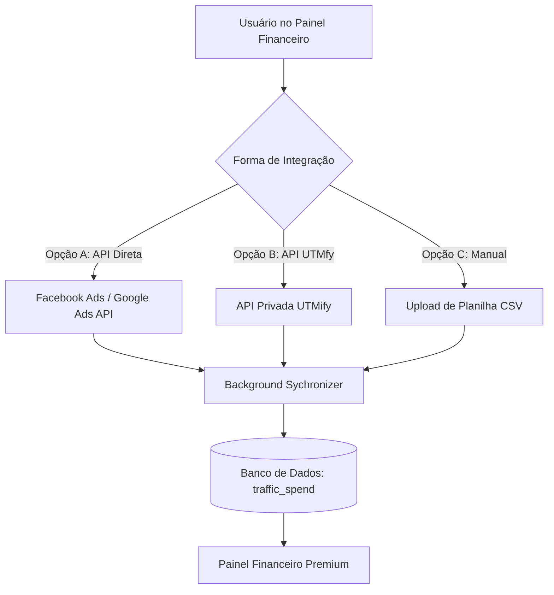
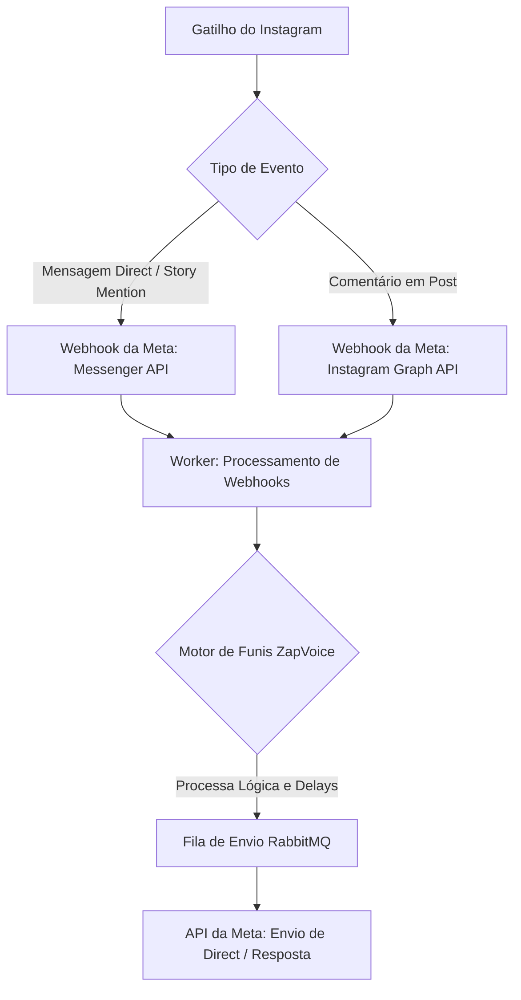
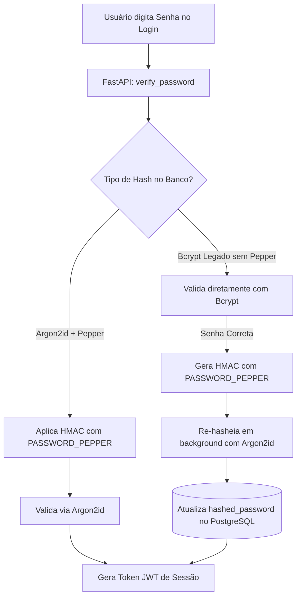

# 🗺️ Roadmap de Evolução - ZapVoice

Este documento registra as melhorias futuras planejadas para o sistema, detalhando a arquitetura sugerida, requisitos e o escopo de cada funcionalidade.

---

## 📈 [NOVO] Integração de Gastos com Tráfego Pago no Financeiro

### 🎯 Objetivo
Permitir que o usuário visualize e compare seus custos de tráfego pago (Ad Spend) diretamente no painel do **Financeiro (`SalesFinancial`)**, gerando insights automáticos de **Lucro Líquido**, **ROAS** (Retorno sobre Gasto em Anúncios) e **ROI** por Dia, Semana e Mês.

### 🛠️ Abordagens de Integração Planejadas



#### Opção A: Conexão Direta com APIs Oficiais (Facebook Ads & Google Ads) — *Recomendado*
*   **Funcionamento:** O cliente fornece um token de acesso de sua BM/Conta de Anúncios. Um worker em segundo plano realiza requisições diárias para consolidar os gastos do período.
*   **Vantagem:** Totalmente independente de terceiros, estável e extremamente profissional.

#### Opção B: Integração via API da UTMfy
*   **Funcionamento:** Conectar à API de Relatórios da UTMfy utilizando a chave gerada pelo cliente no painel da plataforma.

#### Opção C: Importação Manual
*   **Funcionamento:** Upload de CSV exportado do UTMfy/Facebook ou um formulário simples para preenchimento manual dos custos diários/semanais/mensais.

---

### 🎨 Requisitos de Interface (UI/UX Premium)

1.  **Novos StatCards de Métricas:**
    *   `Gasto com Tráfego` (Valor total investido)
    *   `Lucro Líquido` (Faturamento - Custos de Tráfego)
    *   `ROAS Global` (Faturamento / Gasto)
2.  **Tabela de Faturamento Enriquecida:**
    *   Adicionar colunas de **Gasto** e **Margem / ROAS** na tabela consolidada por período.
3.  **Visualização Gráfica:**
    *   Gráfico de linhas comparando a curva de Faturamento vs. Gasto ao longo do tempo.

---

### 💾 Estrutura de Banco de Dados Sugerida (`models.py`)

```python
class TrafficSpend(Base):
    __tablename__ = "traffic_spend"

    id = Column(Integer, primary_key=True, index=True)
    client_id = Column(String, index=True, nullable=False) # Multi-tenant
    date = Column(Date, index=True, nullable=False)
    source = Column(String, nullable=False) # 'facebook_ads', 'google_ads', 'utmify', 'manual'
    amount = Column(Float, nullable=False) # Gasto em BRL
    currency = Column(String, default="BRL")


---

## 📸 [NOVO] Expansão Multicanal: Automação para Instagram Direct & Comentários

### 🎯 Objetivo
Transformar o ZapVoice em uma plataforma multicanal, estendendo o motor de funis e automações existente para o **Instagram**, permitindo criar interações automatizadas via Direct, Story Mentions e respostas automáticas em comentários (estilo ManyChat).

### 🛠️ Abordagens de Integração Planejadas



#### 1. Integração Direta com a Messenger API (Meta Cloud)
*   **Funcionamento:** Utilizar as mesmas credenciais da Meta Developer Cloud configuradas pelo cliente. Um webhook central no backend recebe eventos da Messenger API vinculada à página comercial do Instagram.
*   **Benefício:** Controle completo dos payloads, flexibilidade na criação das automações e taxas zero de intermediários.

#### 2. Fluxos de Gatilho Suportados
*   **Comentário -> Direct:** O lead comenta uma palavra-chave específica em um post e recebe instantaneamente uma mensagem automática e um funil de vendas no direct.
*   **Automação de Resposta Rápida (Direct):** Fluxos de boas-vindas e menus interativos baseados em Quick Replies (botões) do Messenger.
*   **Story Mentions:** Gatilho automático ativado quando o lead marca o perfil da empresa nos Stories.

---

### 🎨 Requisitos de Interface (UI/UX Premium)

1.  **Tela de Gestão de Conexões / Canais:**
    *   Painel onde o usuário vincula suas contas comerciais (WhatsApp e Instagram) com status visual "Online/Offline" para cada canal.
2.  **Identificação de Canal no Construtor de Funis (`VisualFlowBuilder`):**
    *   Possibilidade de definir se um funil ou nó de envio é destinado ao **WhatsApp** ou **Instagram**.
    *   Ajuste dos nós de mensagens para suportar formatos específicos do Instagram (como carrosséis e botões de resposta rápida).
3.  **Logs e Histórico Multicanal:**
    *   Filtros rápidos no Histórico de Disparos para separar envios por Canal (WhatsApp vs. Instagram).
    *   Ícones customizados (📸 para Instagram, 💬 para WhatsApp) na listagem.

---

### 💾 Estrutura de Banco de Dados Sugerida

```python
# Tabela para identificar qual canal o lead e o funil pertencem
class Channel(str, enum.Enum):
    WHATSAPP = "whatsapp"
    INSTAGRAM = "instagram"

# Associação da conta do Instagram por cliente
class InstagramAccount(Base):
    __tablename__ = "instagram_accounts"

    id = Column(Integer, primary_key=True, index=True)
    client_id = Column(String, index=True, nullable=False) # Multi-tenant
    instagram_page_id = Column(String, unique=True, nullable=False)
    page_access_token = Column(String, nullable=False) # Token de acesso à página comercial
    instagram_username = Column(String, nullable=True)
    status = Column(String, default="active") # active, disconnected
```

---

## 🛡️ [PLANEJADO] Criptografia de Senhas Avançada: Argon2id + Pimenta (Pepper HMAC)

### 🎯 Objetivo
Elevar o nível de segurança e conformidade da autenticação do sistema para o padrão ouro da indústria (recomendação OWASP/NIST), migrando o algoritmo de hash de senhas de **`bcrypt`** para **`Argon2id`** integrado a uma **Pimenta (*Pepper HMAC-SHA256*)** global, com suporte a atualização transparente e progressiva de credenciais sem forçar reset de senhas.

### 🌶️ Como funciona o Pepper (Pimenta) nesta Arquitetura?
*   **Salt (Sal):** Armazenado no banco de dados junto com o hash, gerado aleatoriamente e exclusivo por usuário.
*   **Pepper (Pimenta):** Chave criptográfica secreta de 64 caracteres armazenada **exclusivamente nas variáveis de ambiente (`PASSWORD_PEPPER` no `.env`)**, NUNCA gravada no banco de dados.
*   **Defesa em Profundidade (*Defense in Depth*):** Caso ocorra um vazamento ou dump completo do banco PostgreSQL, os hashes são **matematicamente impossíveis de quebrar por força bruta**, pois o atacante não possui a chave secreta da pimenta do servidor.

### 🛠️ Arquitetura e Estratégia de Migração (Zero-Downtime)



### 📋 Checklist de Tarefas de Execução

- [ ] **1. Variável de Ambiente (`.env` e `.env.example`):**
  - Adicionar a variável obrigatória `PASSWORD_PEPPER` com chave segura de 64 caracteres.
  - Validar na inicialização da aplicação (`core/security.py`) se `PASSWORD_PEPPER` está configurada com tamanho mínimo de 32/64 caracteres.
- [ ] **2. Dependências do Backend:**
  - Adicionar `argon2-cffi>=23.1.0` no `backend/requirements.txt` com versão fixa e comentário explicativo.
  - Testar instalação e compilação das extensões C no container Docker.
- [ ] **3. Função HMAC Pepper no `core/security.py`:**
  - Implementar função utilitária `_apply_pepper(password: str) -> str` usando `hmac.new(PASSWORD_PEPPER, password, sha256).hexdigest()`.
  - Configurar `CryptContext(schemes=["argon2", "bcrypt"], deprecated="auto")`.
  - Calibrar os parâmetros de custo de memória e tempo para equilíbrio ideal:
    - `memory_cost`: 65536 (64 MB) ou 32768 (32 MB)
    - `time_cost`: 2 ou 3 iterações
    - `parallelism`: 1 a 2 threads
- [ ] **4. Hook de Migração Automática no Login (`routers/auth.py`):**
  - No fluxo de login, tentar validar primeiro com Argon2id + Pepper.
  - Se falhar e o hash for bcrypt legado, validar via bcrypt simples (sem pepper).
  - Em caso de sucesso do hash legado, aplicar HMAC Pepper + Argon2id e atualizar `user.hashed_password` na mesma transação.
- [ ] **5. Testes Unitários de Segurança:**
  - Criar `tests_unit/test_argon2_pepper_migration.py`:
    - Testar geração de hashes com Argon2id + HMAC Pepper.
    - Testar que a verificação falha caso a senha esteja correta mas a pimenta esteja ausente/incorreta.
    - Testar login e re-hasheamento automático de hashes legados em bcrypt.
    - Testar compatibilidade de tokens JWT.
- [ ] **6. Validação de Desempenho e Carga:**
  - Monitorar consumo de CPU/RAM em pico de logins concorrentes.

