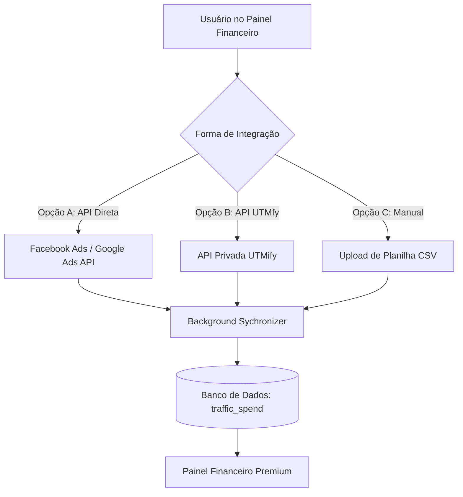
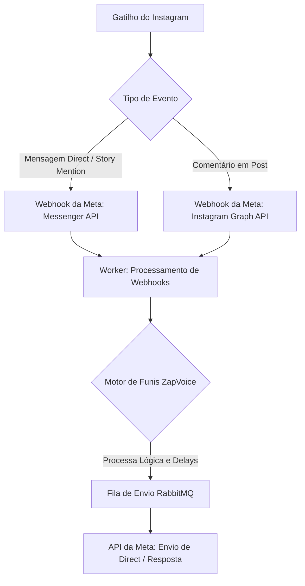

# 🗺️ Roadmap de Evolução - ZapVoice

Este documento registra as melhorias futuras planejadas para o sistema, detalhando a arquitetura sugerida, requisitos e o escopo de cada funcionalidade.

---

## 📈 [NOVO] Integração de Gastos com Tráfego Pago no Financeiro

### 🎯 Objetivo
Permitir que o usuário visualize e compare seus custos de tráfego pago (Ad Spend) diretamente no painel do **Financeiro (`SalesFinancial`)**, gerando insights automáticos de **Lucro Líquido**, **ROAS** (Retorno sobre Gasto em Anúncios) e **ROI** por Dia, Semana e Mês.

### 🛠️ Abordagens de Integração Planejadas



#### Opção A: Conexão Direta com APIs Oficiais (Facebook Ads & Google Ads) — *Recomendado*
*   **Funcionamento:** O cliente fornece um token de acesso de sua BM/Conta de Anúncios. Um worker em segundo plano realiza requisições diárias para consolidar os gastos do período.
*   **Vantagem:** Totalmente independente de terceiros, estável e extremamente profissional.

#### Opção B: Integração via API da UTMfy
*   **Funcionamento:** Conectar à API de Relatórios da UTMfy utilizando a chave gerada pelo cliente no painel da plataforma.

#### Opção C: Importação Manual
*   **Funcionamento:** Upload de CSV exportado do UTMfy/Facebook ou um formulário simples para preenchimento manual dos custos diários/semanais/mensais.

---

### 🎨 Requisitos de Interface (UI/UX Premium)

1.  **Novos StatCards de Métricas:**
    *   `Gasto com Tráfego` (Valor total investido)
    *   `Lucro Líquido` (Faturamento - Custos de Tráfego)
    *   `ROAS Global` (Faturamento / Gasto)
2.  **Tabela de Faturamento Enriquecida:**
    *   Adicionar colunas de **Gasto** e **Margem / ROAS** na tabela consolidada por período.
3.  **Visualização Gráfica:**
    *   Gráfico de linhas comparando a curva de Faturamento vs. Gasto ao longo do tempo.

---

### 💾 Estrutura de Banco de Dados Sugerida (`models.py`)

```python
class TrafficSpend(Base):
    __tablename__ = "traffic_spend"

    id = Column(Integer, primary_key=True, index=True)
    client_id = Column(String, index=True, nullable=False) # Multi-tenant
    date = Column(Date, index=True, nullable=False)
    source = Column(String, nullable=False) # 'facebook_ads', 'google_ads', 'utmify', 'manual'
    amount = Column(Float, nullable=False) # Gasto em BRL
    currency = Column(String, default="BRL")


---

## 📸 [NOVO] Expansão Multicanal: Automação para Instagram Direct & Comentários

### 🎯 Objetivo
Transformar o ZapVoice em uma plataforma multicanal, estendendo o motor de funis e automações existente para o **Instagram**, permitindo criar interações automatizadas via Direct, Story Mentions e respostas automáticas em comentários (estilo ManyChat).

### 🛠️ Abordagens de Integração Planejadas



#### 1. Integração Direta com a Messenger API (Meta Cloud)
*   **Funcionamento:** Utilizar as mesmas credenciais da Meta Developer Cloud configuradas pelo cliente. Um webhook central no backend recebe eventos da Messenger API vinculada à página comercial do Instagram.
*   **Benefício:** Controle completo dos payloads, flexibilidade na criação das automações e taxas zero de intermediários.

#### 2. Fluxos de Gatilho Suportados
*   **Comentário -> Direct:** O lead comenta uma palavra-chave específica em um post e recebe instantaneamente uma mensagem automática e um funil de vendas no direct.
*   **Automação de Resposta Rápida (Direct):** Fluxos de boas-vindas e menus interativos baseados em Quick Replies (botões) do Messenger.
*   **Story Mentions:** Gatilho automático ativado quando o lead marca o perfil da empresa nos Stories.

---

### 🎨 Requisitos de Interface (UI/UX Premium)

1.  **Tela de Gestão de Conexões / Canais:**
    *   Painel onde o usuário vincula suas contas comerciais (WhatsApp e Instagram) com status visual "Online/Offline" para cada canal.
2.  **Identificação de Canal no Construtor de Funis (`VisualFlowBuilder`):**
    *   Possibilidade de definir se um funil ou nó de envio é destinado ao **WhatsApp** ou **Instagram**.
    *   Ajuste dos nós de mensagens para suportar formatos específicos do Instagram (como carrosséis e botões de resposta rápida).
3.  **Logs e Histórico Multicanal:**
    *   Filtros rápidos no Histórico de Disparos para separar envios por Canal (WhatsApp vs. Instagram).
    *   Ícones customizados (📸 para Instagram, 💬 para WhatsApp) na listagem.

---

### 💾 Estrutura de Banco de Dados Sugerida

```python
# Tabela para identificar qual canal o lead e o funil pertencem
class Channel(str, enum.Enum):
    WHATSAPP = "whatsapp"
    INSTAGRAM = "instagram"

# Associação da conta do Instagram por cliente
class InstagramAccount(Base):
    __tablename__ = "instagram_accounts"

    id = Column(Integer, primary_key=True, index=True)
    client_id = Column(String, index=True, nullable=False) # Multi-tenant
    instagram_page_id = Column(String, unique=True, nullable=False)
    page_access_token = Column(String, nullable=False) # Token de acesso à página comercial
    instagram_username = Column(String, nullable=True)
    status = Column(String, default="active") # active, disconnected
```
