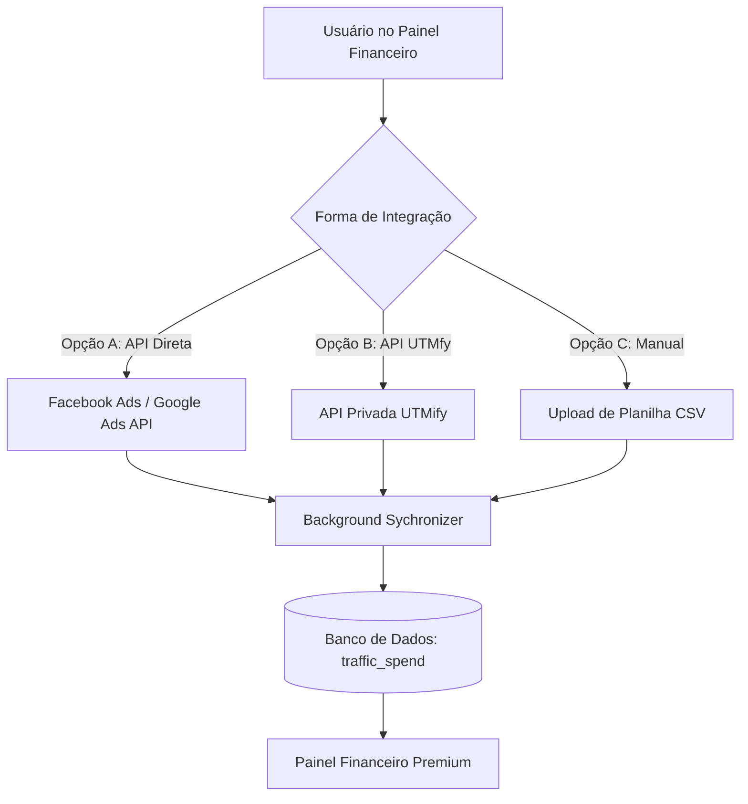

# 🗺️ Roadmap de Evolução - ZapVoice

Este documento registra as melhorias futuras planejadas para o sistema, detalhando a arquitetura sugerida, requisitos e o escopo de cada funcionalidade.

---

## 📈 [NOVO] Integração de Gastos com Tráfego Pago no Financeiro

### 🎯 Objetivo
Permitir que o usuário visualize e compare seus custos de tráfego pago (Ad Spend) diretamente no painel do **Financeiro (`SalesFinancial`)**, gerando insights automáticos de **Lucro Líquido**, **ROAS** (Retorno sobre Gasto em Anúncios) e **ROI** por Dia, Semana e Mês.

### 🛠️ Abordagens de Integração Planejadas



#### Opção A: Conexão Direta com APIs Oficiais (Facebook Ads & Google Ads) — *Recomendado*
*   **Funcionamento:** O cliente fornece um token de acesso de sua BM/Conta de Anúncios. Um worker em segundo plano realiza requisições diárias para consolidar os gastos do período.
*   **Vantagem:** Totalmente independente de terceiros, estável e extremamente profissional.

#### Opção B: Integração via API da UTMfy
*   **Funcionamento:** Conectar à API de Relatórios da UTMfy utilizando a chave gerada pelo cliente no painel da plataforma.

#### Opção C: Importação Manual
*   **Funcionamento:** Upload de CSV exportado do UTMfy/Facebook ou um formulário simples para preenchimento manual dos custos diários/semanais/mensais.

---

### 🎨 Requisitos de Interface (UI/UX Premium)

1.  **Novos StatCards de Métricas:**
    *   `Gasto com Tráfego` (Valor total investido)
    *   `Lucro Líquido` (Faturamento - Custos de Tráfego)
    *   `ROAS Global` (Faturamento / Gasto)
2.  **Tabela de Faturamento Enriquecida:**
    *   Adicionar colunas de **Gasto** e **Margem / ROAS** na tabela consolidada por período.
3.  **Visualização Gráfica:**
    *   Gráfico de linhas comparando a curva de Faturamento vs. Gasto ao longo do tempo.

---

### 💾 Estrutura de Banco de Dados Sugerida (`models.py`)

```python
class TrafficSpend(Base):
    __tablename__ = "traffic_spend"

    id = Column(Integer, primary_key=True, index=True)
    client_id = Column(String, index=True, nullable=False) # Multi-tenant
    date = Column(Date, index=True, nullable=False)
    source = Column(String, nullable=False) # 'facebook_ads', 'google_ads', 'utmify', 'manual'
    amount = Column(Float, nullable=False) # Gasto em BRL
    currency = Column(String, default="BRL")
```
