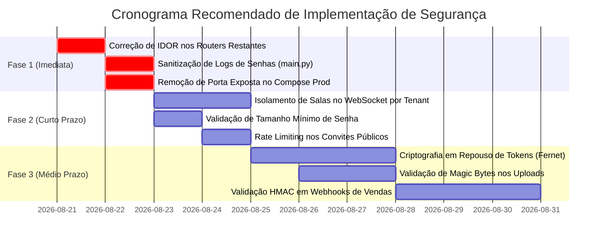

# 🛡️ Guia e Roadmap de Auditoria de Segurança — ZapVoice

Este documento consolida o diagnóstico de segurança da aplicação **ZapVoice**, detalhando os pontos fortes já existentes, as vulnerabilidades e riscos identificados na base de código atual, e o guia prático passo a passo de correção para cada tópico.

---

## 📌 Sumário Executivo

| Nível de Risco | Quantidade | Foco Principal |
| :--- | :---: | :--- |
| 🚨 **Crítico** | 3 | IDOR em Multi-tenancy, Exposição de Senhas em Logs e Porta Direta no Docker |
| ⚠️ **Alto** | 3 | Isolamento WebSocket, Falta de Criptografia de Tokens no Banco e Políticas de Senha |
| 🟡 **Médio** | 3 | Rate Limiting em Convites, Validação de Magic Bytes em Uploads e Assinaturas HMAC de Webhooks |
| 🟢 **Boas Práticas Existentes** | 4 | Argon2id + Pepper, Rate Limiting SlowAPI, Headers de Segurança HTTP e RBAC Básico |

---

## 🔍 Tópicos de Segurança para Observar e Corrigir

---

### 🚨 1. Isolamento Multi-tenant e Prevenção de IDOR (Insecure Direct Object Reference)

* **O que observar:**
  Algumas rotas recebem o cabeçalho `X-Client-ID` como parâmetro simples (`x_client_id: Optional[str] = Header(None)`) e apenas convertem o valor para inteiro (`int(x_client_id)`), sem verificar se o usuário autenticado realmente tem acesso àquele `client_id`.
* **Arquivos afetados:**
  * [`backend/routers/api_keys.py`](file:///c:/Users/aryar/.gemini/antigravity/scratch/Projetos%20Serios/Projeto%20-%20ZapVoice%20no%20Chatwoot/backend/routers/api_keys.py) (criação, listagem e revogação de API Keys).
  * [`backend/routers/uploads.py`](file:///c:/Users/aryar/.gemini/antigravity/scratch/Projetos%20Serios/Projeto%20-%20ZapVoice%20no%20Chatwoot/backend/routers/uploads.py) (registro e listagem de mídias enviadas).
* **Risco e Impacto:**
  Um usuário autenticado de uma empresa A pode forjar o cabeçalho `X-Client-ID: <id_empresa_B>` e criar, listar ou revogar chaves de API e mídias de outra empresa.
* **Como corrigir:**
  Substituir a leitura manual do header pela dependência centralizada `get_validated_client_id` em todos os endpoints:
  ```python
  # De:
  x_client_id: Optional[str] = Header(None)
  
  # Para:
  x_client_id: int = Depends(get_validated_client_id)
  ```

---

### 🚨 2. Prevenção de Vazamento de Senhas em Logs de Validação (PII / Credentials)

* **O que observar:**
  No arquivo [`backend/main.py`](file:///c:/Users/aryar/.gemini/antigravity/scratch/Projetos%20Serios/Projeto%20-%20ZapVoice%20no%20Chatwoot/backend/main.py#L166-L172), o manipulador global de erros de validação do FastAPI (`RequestValidationError`) captura e grava em log o corpo inteiro da requisição (`await request.body()`).
* **Risco e Impacto:**
  Se um usuário errar a validação ao fazer login (`/auth/token`), registrar usuário (`/auth/register`) ou redefinir senha (`/auth/reset-password`), a senha digitada em texto puro será registrada permanentemente no arquivo `zapvoice_debug.log`.
* **Como corrigir:**
  Sanitizar o log removendo a impressão do corpo bruto ou ocultando campos sensíveis:
  ```python
  @app.exception_handler(RequestValidationError)
  async def validation_exception_handler(request: Request, exc: RequestValidationError):
      # Loga apenas o caminho e a estrutura do erro, sem expor o corpo bruto com senhas
      logger.warning(f"⚠️ [VALIDATION_ERROR] {request.method} {request.url.path} - Erros: {exc.errors()}")
      return JSONResponse(
          status_code=422,
          content={"detail": exc.errors()}
      )
  ```

---

### 🚨 3. Fechamento de Porta Exposta no Docker Compose de Produção

* **O que observar:**
  No arquivo [`docker/docker-compose-producao.yml`](file:///c:/Users/aryar/.gemini/antigravity/scratch/Projetos%20Serios/Projeto%20-%20ZapVoice%20no%20Chatwoot/docker/docker-compose-producao.yml#L12), o container da API possui o mapeamento de portas ativo:
  ```yaml
  ports:
    - 8000:8000
  ```
  enquanto o serviço já está integrado à rede interna do Traefik (`docker_zapvoice_net`).
* **Risco e Impacto:**
  Se a porta 8000 não estiver bloqueada no firewall do host (UFW/Security Group), invasores podem acessar a API diretamente via `http://IP-DO-SERVIDOR:8000`, contornando certificados SSL, autenticação do Traefik, WAF ou bloqueios de IP.
* **Como corrigir:**
  Remover a seção `ports:` do `zapvoice_app` no arquivo de produção, garantindo que todo o tráfego passe exclusivamente pelo Traefik na porta 443/HTTPS.

---

### ⚠️ 4. Segurança do WebSocket & Isolamento de Mensagens em Tempo Real

* **O que observar:**
  1. No endpoint `/ws` ([`backend/main.py`](file:///c:/Users/aryar/.gemini/antigravity/scratch/Projetos%20Serios/Projeto%20-%20ZapVoice%20no%20Chatwoot/backend/main.py#L653-L670)), o evento `subscribe_client` vincula a conexão a qualquer `client_id` enviado pelo frontend, sem checar se o usuário autenticado pelo JWT pertence àquele cliente.
  2. O método `manager.broadcast()` no [`backend/websocket_manager.py`](file:///c:/Users/aryar/.gemini/antigravity/scratch/Projetos%20Serios/Projeto%20-%20ZapVoice%20no%20Chatwoot/backend/websocket_manager.py) envia notificações de novos usuários (`user_created`, `profile_updated`) para **todas** as conexões conectadas no servidor, sem filtrar por tenant.
* **Risco e Impacto:**
  Vazamento de eventos, cadastros de novos membros e métricas de atendimento em tempo real entre diferentes clientes cadastrados na mesma instância.
* **Como corrigir:**
  * Validar no banco se o usuário do JWT possui acesso ao `client_id` antes de aceitar a assinatura no WebSocket.
  * Criar método `broadcast_to_client(client_id, message)` no `ConnectionManager` para disparar eventos apenas aos sockets autenticados naquele tenant específico.

---

### ⚠️ 5. Política de Complexidade e Tamanho Mínimo de Senhas

* **O que observar:**
  Os schemas Pydantic de criação e redefinição de usuários (`UserCreate`, `UserRegisterInvite`, `ProfileUpdate`, `PasswordReset`) nos arquivos [`backend/routers/auth.py`](file:///c:/Users/aryar/.gemini/antigravity/scratch/Projetos%20Serios/Projeto%20-%20ZapVoice%20no%20Chatwoot/backend/routers/auth.py) e [`backend/routers/invitations.py`](file:///c:/Users/aryar/.gemini/antigravity/scratch/Projetos%20Serios/Projeto%20-%20ZapVoice%20no%20Chatwoot/backend/routers/invitations.py) aceitam senhas de qualquer tamanho (mesmo 1 caractere).
* **Risco e Impacto:**
  Usuários e administradores podem cadastrar senhas fracas (`123456`, `1`, `admin`), facilitando ataques de força bruta ou adivinhação.
* **Como corrigir:**
  Adicionar validação estrita com Pydantic `Field(..., min_length=8)` e validação de caracteres (ao menos uma letra e um número):
  ```python
  from pydantic import BaseModel, Field

  class UserCreate(BaseModel):
      email: str
      password: str = Field(..., min_length=8, description="Senha com no mínimo 8 caracteres")
      # ...
  ```

---

### ⚠️ 6. Criptografia em Repouso para Tokens de Integração (Field-Level Encryption)

* **O que observar:**
  Tokens de terceiros sensíveis (Access Tokens da Meta Cloud API, Chaves de API do ManyChat, credenciais de e-mail SMTP) são gravados em texto claro nas tabelas `settings`, `webhook_configs` e `waba_payments`.
* **Risco e Impacto:**
  Em caso de vazamento acidental de dump de banco de dados ou acesso indevido ao banco PostgreSQL, todos os números de WhatsApp e contas conectadas ficam expostos.
* **Como corrigir:**
  Implementar um serviço de criptografia simétrica com `cryptography.fernet.Fernet` ou AES-256-GCM para criptografar os tokens antes de salvar no banco e descriptografar apenas na memória durante o uso:
  ```python
  # .env
  ENCRYPTION_KEY="chave-base64-gerada-segura"
  ```

---

### 🟡 7. Rate Limiting em Rotas Públicas de Convites e Recuperação

* **O que observar:**
  Os endpoints de convite público no [`backend/routers/invitations.py`](file:///c:/Users/aryar/.gemini/antigravity/scratch/Projetos%20Serios/Projeto%20-%20ZapVoice%20no%20Chatwoot/backend/routers/invitations.py):
  * `GET /auth/invitations/{token}` (verificação de convite)
  * `POST /auth/invitations/{token}/register` (cadastro via convite)
  não possuem decorador de rate limit `@limiter.limit(...)`.
* **Risco e Impacto:**
  Possibilidade de ataque de força bruta contra tokens de convite ou geração de sobrecarga/negação de serviço (DoS) nesses endpoints públicos.
* **Como corrigir:**
  Aplicar limite estrito por IP nesses endpoints:
  ```python
  @router.post("/{token}/register")
  @limiter.limit("10/minute")
  async def register_by_invitation(...):
  ```

---

### 🟡 8. Validação de Uploads por Magic Bytes (MIME Sniffing Real)

* **O que observar:**
  No [`backend/routers/uploads.py`](file:///c:/Users/aryar/.gemini/antigravity/scratch/Projetos%20Serios/Projeto%20-%20ZapVoice%20no%20Chatwoot/backend/routers/uploads.py#L50-L68), a validação de arquivos aceitos checa apenas a extensão do arquivo (`.png`, `.pdf`, etc.) e o header `file.content_type` enviado pelo cliente.
* **Risco e Impacto:**
  Um invasor pode renomear um arquivo malicioso executável ou script PHP/HTML para `.png` ou `.pdf` e enviar com `Content-Type: image/png`.
* **Como corrigir:**
  Utilizar biblioteca de inspeção de bytes reais (como `puremagic`):
  ```python
  import puremagic

  header_bytes = file.file.read(2048)
  file.file.seek(0)
  detected_ext = puremagic.from_string(header_bytes)
  ```

---

### 🟢 9. Validação Criptográfica de Assinatura nos Webhooks de Entrada [IMPLEMENTADO]

* **O que foi implementado:**
  * Módulo centralizado [`backend/core/webhook_security.py`](file:///c:/Users/aryar/.gemini/antigravity/scratch/Projetos%20Serios/Projeto%20-%20ZapVoice%20no%20Chatwoot/backend/core/webhook_security.py) com validações criptográficas de tempo constante (`hmac.compare_digest`):
    * **Meta WhatsApp**: Header `X-Hub-Signature-256` validado com App Secret (`META_APP_SECRET` por tenant ou global).
    * **Hotmart**: Token `hottok` validado no payload ou header `X-Hotmart-Hottok`.
    * **Kiwify**: Assinatura/token validado contra `webhook_secret`.
    * **Stripe**: Header `Stripe-Signature` (`t=timestamp,v1=signature`) com verificação de drift temporal de 300s contra Replay Attacks.
    * **Webhooks Genéricos**: Assinatura HMAC-SHA256 ou tokens bearer/api-key.
  * Integração ativa em [`backend/routers/webhooks_public.py`](file:///c:/Users/aryar/.gemini/antigravity/scratch/Projetos%20Serios/Projeto%20-%20ZapVoice%20no%20Chatwoot/backend/routers/webhooks_public.py) e [`backend/routers/webhooks_inbound/meta.py`](file:///c:/Users/aryar/.gemini/antigravity/scratch/Projetos%20Serios/Projeto%20-%20ZapVoice%20no%20Chatwoot/backend/routers/webhooks_inbound/meta.py).
  * 100% dos testes unitários validados em `backend/tests_unit/test_webhook_security.py`.


---

## 🛡️ Boas Práticas Já Ativas no Projeto

1. **Argon2id + Password Pepper (HMAC-SHA256):**
   * Senhas são protegidas com o algoritmo padrão OWASP (Argon2id) combinado com uma "pimenta" secreta em variável de ambiente (`PASSWORD_PEPPER`), tornando dumps offline imunes a ataques por Rainbow Tables.
2. **Rate Limiting Contextual com SlowAPI:**
   * Limite de requisições padrão isolado por usuário autenticado (`user:{email}`) e por IP para requisições não autenticadas, impedindo que um cliente sature os limites de outro atrás de proxies reversos.
3. **Auditoria Contínua de Dependências:**
   * Script automatizado `python scripts/audit_security.py` (`pip-audit`) executado obrigatoriamente antes de commits/pushes para identificar vulnerabilidades conhecidas (CVEs).
4. **Proteção contra Clickjacking e MIME Sniffing:**
   * Middleware global aplicando os cabeçalhos `X-Content-Type-Options: nosniff`, `X-Frame-Options: DENY` e `X-XSS-Protection: 1; mode=block`.

---

## 📅 Matriz de Priorização das Correções



---

## 🔒 Checklist de Segurança para Deploys e Releases

- [ ] Variável `SECRET_KEY` configurada com ao menos 64 caracteres aleatórios e seguros.
- [ ] Variável `PASSWORD_PEPPER` preenchida no `.env` do servidor.
- [ ] `ENABLE_DOCS=false` em produção para desabilitar documentação Swagger pública.
- [ ] `pip-audit` executado com zero vulnerabilidades críticas conhecidas.
- [ ] Permissões de arquivo restritas no container Docker.
- [ ] Backups diários com retenção automática configurados no S3/Backblaze.
